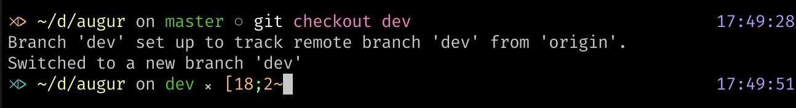
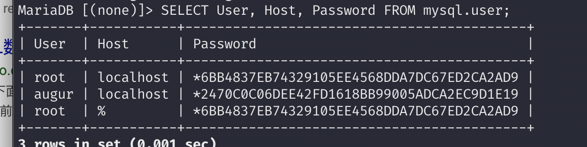
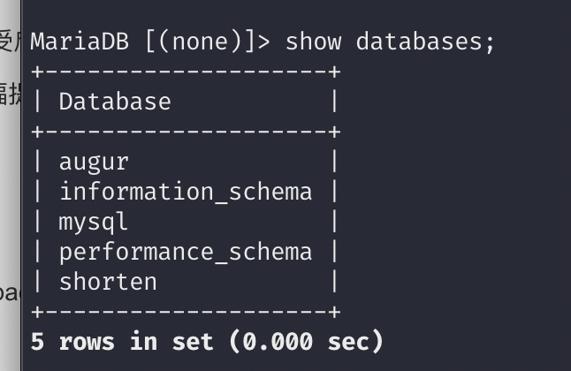
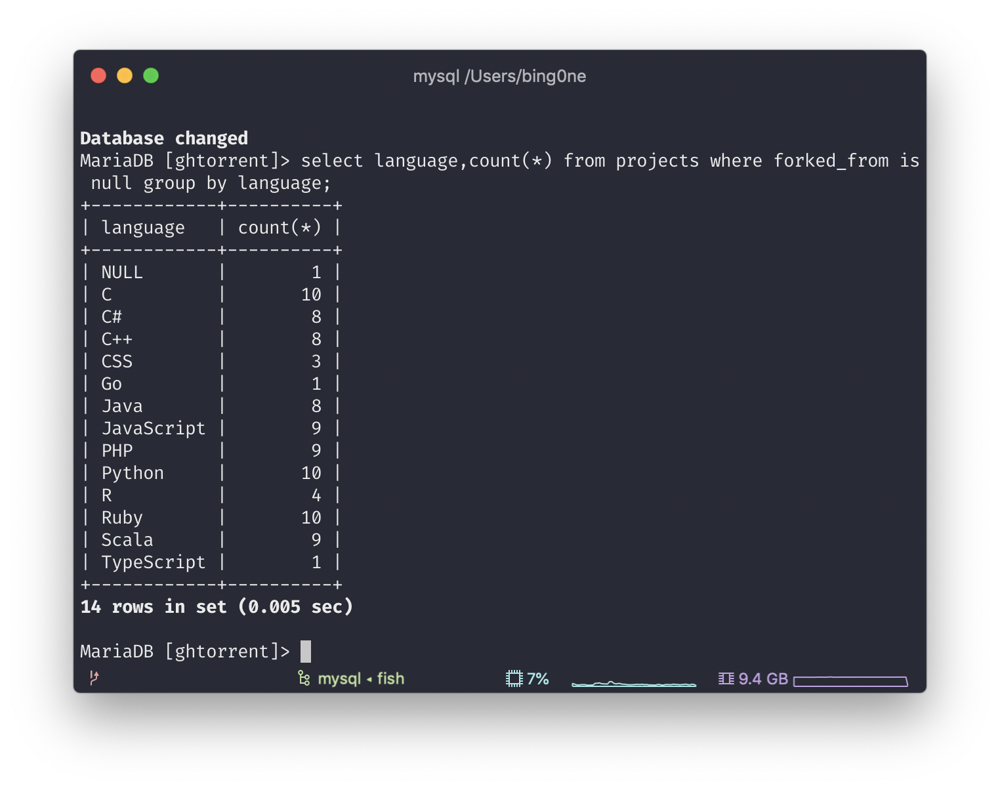
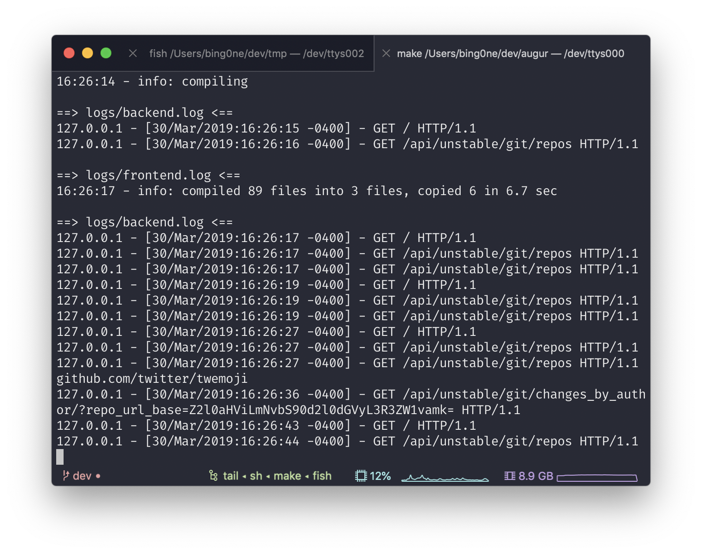
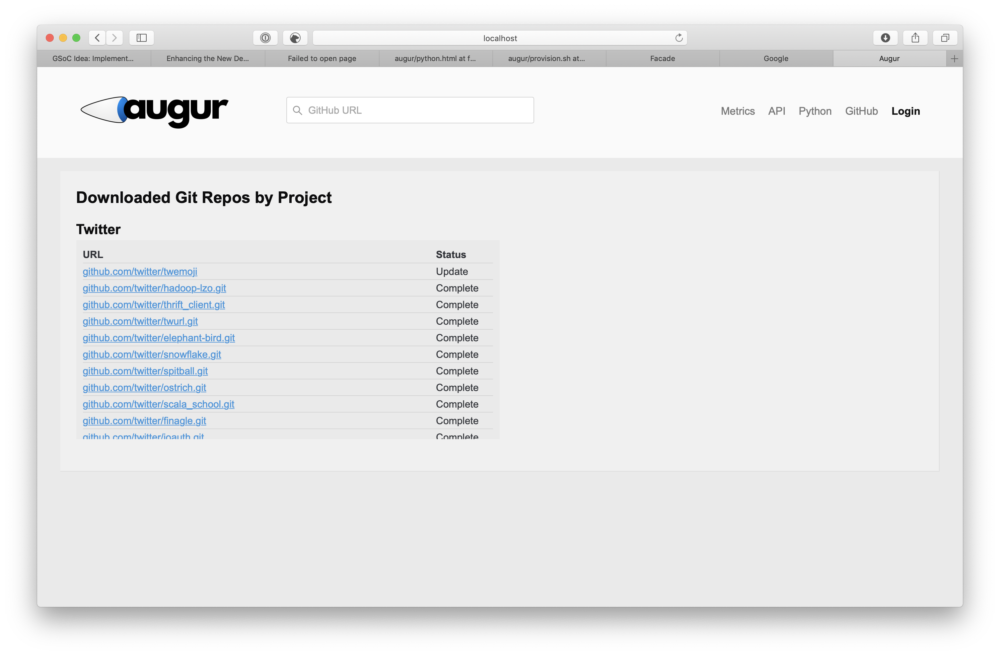

# Microtask 0

## Switch to Dev branch 

```bash
git checkout dev
```




## Dependecy Installation

According to the installation instruction, we should install `homebrew`, `node` and 'mariadb'. In my laptop, I have installed `homebrew`, `yarn` and `npm`. 


In my laptop, I use pyenv to  manage my python environemnt. So we use pyenv to install and activate anaconda3 5.1.0.

```bash
pyenv install anaconda3-5.1.0 # download will take a long time
pyenv local anaconda3-5.1.0 # activate conda in the local file
```

## Augur Installation 


Install the Python and Node tools and libraries needed. 

```bash
sudo make install-dev
```

## Config Maraidb

Log into Maraidb Docker
```bash
docker start db
exec -it db bash # loginto bash 
```

Create User

In the installation instruction, the website has a typo of "PRIVILEGES". 

```sql
CREATE USER 'augur'@'localhost' IDENTIFIED BY 'password';

CREATE DATABASE augur;
```




### Install Dataset

The Ghtorrent is very easy to install, I just need to follow the [README](http://ghtorrent.org/msr14.html).



But the dataset FACADES is hard to find. By taking a look at how Vagrant install the dataset, I found a repo called [vagrant-data](https://github.com/augurlabs/vagrant-data.git). Follow the file [provision.sh](https://github.com/chaoss/augur/blob/hotfix/util/packaging/vagrant/provision.sh), I imported Facade Twitter dataset.

## Run frontend and backend

```bash
make dev 
```


## Expertiments


## Read Posts
