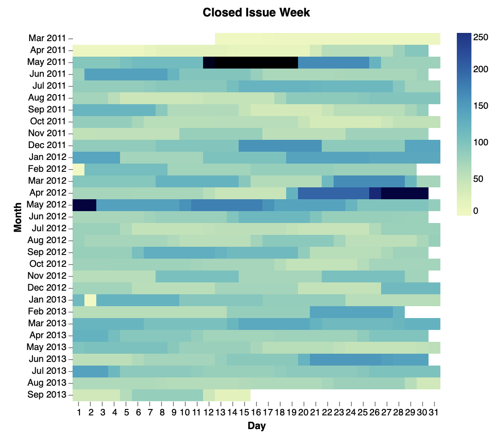
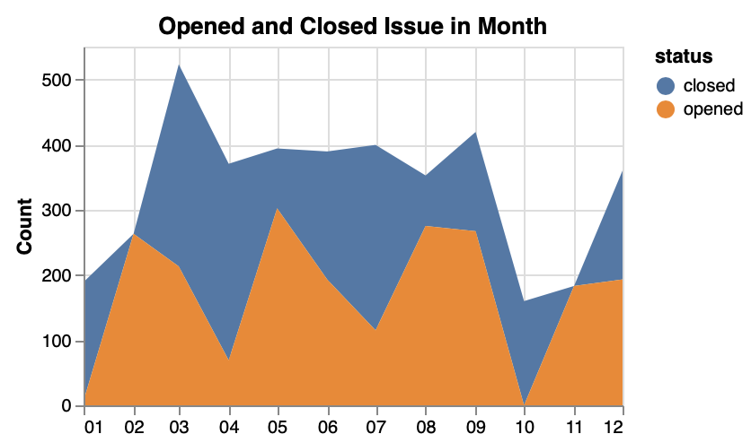

 # Microtask 2 

Augur frontend is based on Vue.js. When I take a look at the components/charts file, I found that Augur use Vege-Lite to draw chart. After reading tutorial of Vega-Lite, it is not too hard to draw our own chart. 

According to this [post](https://blog.socialcops.com/academy/resources/visualizing-time-series-data/), Polar Area Diagram and Heat Map is a good choice for time serires. 

## Heat Map 

There is a Vega-Lite [json](https://gist.github.com/bing0n3/73f508b1a4cc2c165413b3a8b9549fd8) to genereate this heat map.

## Stacked Area Chars

There is a Vega-Lite [json]() to genereate Stacked Area Chars for open/close issues.

